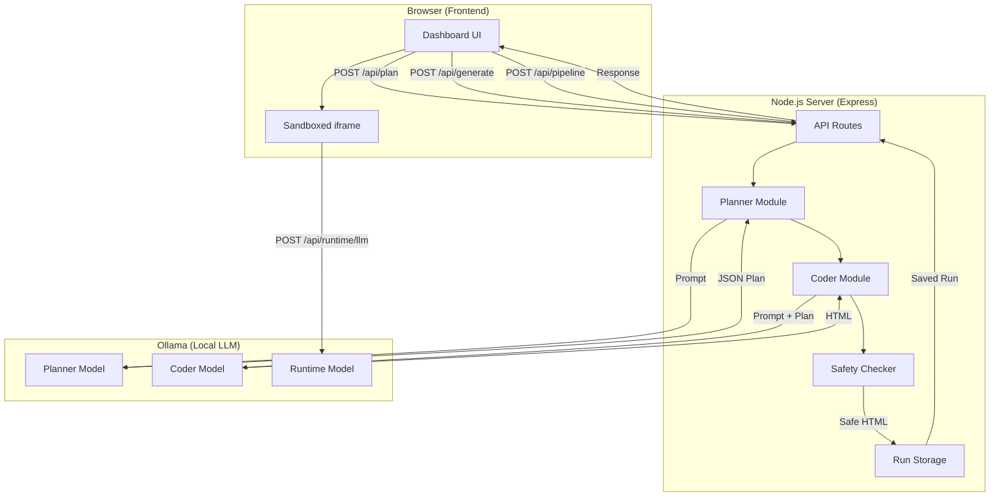

# GE AI Tool - Architecture & Pipeline Documentation

## Overview

The GE AI Tool is a local web application that generates complete HTML/CSS/JS web experiences using a two-stage LLM pipeline. Everything runs locally via Ollama.

---

## Architecture Diagram



---

## Core Components

### 1. Frontend ([public/](file:///Users/mohamedkonsowa/Desktop/GE_PrototypeV1/geappliances-ai-tool-prototype/public))

| File | Purpose |
|------|---------|
| `index.html` | Dashboard structure with Create/Saved tabs |
| `styles.css` | Modern UI design system |
| `app.js` | API calls, state management, UI updates |

### 2. Backend ([server.js](file:///Users/mohamedkonsowa/Desktop/GE_PrototypeV1/geappliances-ai-tool-prototype/server.js))

**Key Modules:**

| Function | Lines | Description |
|----------|-------|-------------|
| `callOllama()` | 126-168 | HTTP client to Ollama API with timeout |
| `buildPlannerPrompt()` | 170-194 | Creates prompt for planner LLM |
| `buildCoderPrompt()` | 196-221 | Creates prompt for coder LLM |
| `requestPlan()` | 258-288 | Calls planner with auto-retry on JSON errors |
| `requestHtml()` | 290-309 | Calls coder and validates output |
| `checkUnsafeHtml()` | 335-354 | Security validation |
| `saveRun()` | 356-385 | Persists run to filesystem |

---

## Pipeline Flow

### Main Pipeline (`POST /api/pipeline`)

```
User Prompt
    │
    ▼
┌─────────────┐
│  PLANNER    │ ◄── Generates structured JSON plan
│  (LLM #1)   │     with title, components, state, interactions
└─────────────┘
    │
    ▼
┌─────────────┐
│   CODER     │ ◄── Generates complete HTML/CSS/JS
│  (LLM #2)   │     from plan specification
└─────────────┘
    │
    ▼
┌─────────────┐
│  SAFETY     │ ◄── Rejects forbidden patterns
│  CHECKER    │     (fetch, iframe, WebSocket, etc.)
└─────────────┘
    │
    ▼
┌─────────────┐
│  INJECTION  │ ◄── Adds CSP meta tag
│             │     Injects window.geaRuntimeLLM helper
└─────────────┘
    │
    ▼
┌─────────────┐
│   STORAGE   │ ◄── Saves to runs/<timestamp>/
└─────────────┘
    │
    ▼
  Response to browser
```

### Step-by-Step Process

1. **User enters prompt** → Frontend sends to `/api/plan` or `/api/pipeline`

2. **Planner LLM** receives prompt with schema example:
   ```json
   {
     "title": "...",
     "description": "...",
     "pages": [{"name": "Home", "purpose": "..."}],
     "ui_components": ["..."],
     "state": ["..."],
     "interactions": ["..."],
     "acceptance_criteria": ["..."]
   }
   ```

3. **JSON Parsing** with fallbacks:
   - Direct `JSON.parse()`
   - Extract from markdown fences
   - Extract from first `{` to last `}`
   - Repair with `jsonrepair` library

4. **Coder LLM** receives plan + requirements:
   - Inline CSS in `<style>`
   - Inline JS in `<script>`
   - No external resources
   - Include CSP meta tag
   - Use `window.geaRuntimeLLM()` for AI calls

5. **Safety Check** rejects:
   - `<iframe>`, `<object>`, `<embed>`
   - `fetch()`, `XMLHttpRequest`, `WebSocket`
   - `<meta http-equiv="refresh">`
   - `window.location=` / `document.location=`

6. **Run saved** to `runs/<timestamp>/`:
   - `prompt.txt` - Original user prompt
   - `plan.json` - Planner output
   - `page.html` - Generated code
   - `meta.json` - Models used, timing data

---

## API Reference

| Endpoint | Method | Description |
|----------|--------|-------------|
| `/api/health` | GET | Server health check |
| `/api/config` | GET | Returns configured models |
| `/api/plan` | POST | Run planner only |
| `/api/generate` | POST | Run coder with existing plan |
| `/api/pipeline` | POST | Full pipeline (plan + code) |
| `/api/iterate` | POST | Modify existing generation |
| `/api/runtime/llm` | POST | LLM call from generated pages |
| `/api/runs` | GET | List all saved runs |
| `/api/run/:timestamp` | GET | Get run details |
| `/api/run/:timestamp/page.html` | GET | Serve generated HTML |

---

## Security Model

### Content Security Policy
```
default-src 'none';
img-src data:;
style-src 'unsafe-inline';
script-src 'unsafe-inline';
connect-src 'self' http://localhost:* http://127.0.0.1:*;
base-uri 'none';
form-action 'none';
```

### Sandbox Attributes
Generated HTML runs in iframe with:
```html
<iframe sandbox="allow-scripts allow-forms">
```

### Runtime LLM Helper
Generated pages call AI via injected helper:
```javascript
const reply = await window.geaRuntimeLLM("prompt", { model: "llama3.1" });
```
This routes through `/api/runtime/llm` with CORS headers for null-origin iframes.

---

## Configuration

| Variable | Default | Description |
|----------|---------|-------------|
| `PORT` | 3000 | Server port |
| `HOST` | 0.0.0.0 | Bind address |
| `PLANNER_MODEL` | llama3.1 | Model for planning |
| `CODER_MODEL` | llama3.1 | Model for code generation |
| `RUNTIME_MODEL` | (same as coder) | Model for runtime calls |
| `MODEL_OPTIONS` | - | Comma-separated model list for UI |
| `LLM_TIMEOUT_MS` | 120000 | Max wait for Ollama response |

---

## Data Storage

```
runs/
├── 20260112_153000_123/
│   ├── prompt.txt      # User's original prompt
│   ├── plan.json       # Planner output
│   ├── page.html       # Generated code
│   └── meta.json       # Metadata (models, timing)
└── 20260112_154500_456/
    └── ...
```
