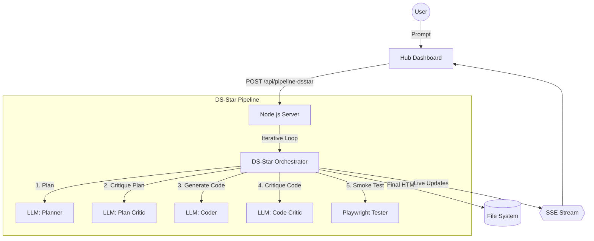
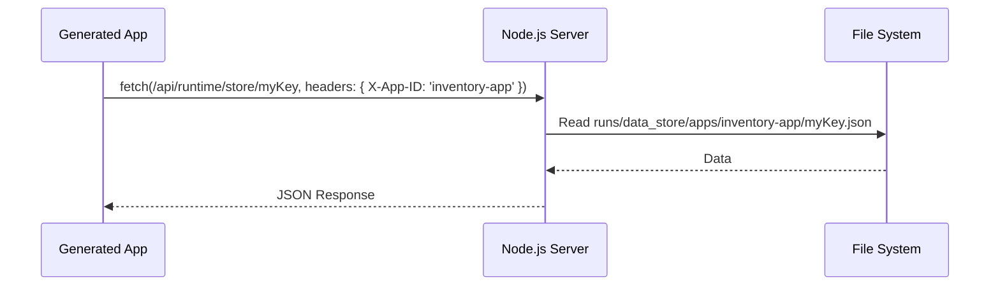

# GE AI Tool Prototype: Technical Architecture

This document provides a high-level overview of the system architecture, major components, and the DS-Star iterative pipeline.

## System Architecture

> **Figure 1**: High-level architecture of the DS-Star pipeline showing the iterative refinement loop between LLM agents and automated validation.

## System Overview

The GE AI Tool Prototype is a self-improving web application builder. It uses a multi-agent approach (Planner, Coder, Critic) to iteratively generate, test, and refine standalone web tools.

## Key Components

### 1. DS-Star Orchestrator
The "brain" of the system. It manages the loop that ensures code doesn't just look good, but actually works.
- **Planning Phase**: Extracts structured requirements from the user prompt.
- **Iteration Phase**: If a critique or test fails, it provides the "History" of failures back to the LLM to prevent repeat mistakes.
- **Self-Correction**: Uses Playwright to physically "open" the generated app and check for console errors or missing elements.

### 2. The Runtime Bridge (`window.geaRuntime...`)
Generated apps are NOT just static HTML. They are injected with a powerful bridge to the hub:
- **`window.geaRuntimeLLM`**: Allows the generated app to call AI models without needing an API key.
- **`window.geaRuntimeStore`**: A persistent Key-Value store that saves data to the server. It uses namespacing to ensure different apps don't overwrite each other's data.

### 3. Deployment & Promotion System
Ensures that successful experiments can be turned into permanent tools.
- **Run Directory**: Every generation lives in `runs/[timestamp]`.
- **Promotion**: Clicking "Deploy" copies the `final.html` to `runs/deployments/[app-name]`.
- **Namespaced Storage**: Deployed apps send a special `X-App-ID` header, causing the server to isolate their data in `runs/data_store/apps/[app-name]`.

## Data Flow: Storage & Namespacing

## Security & Sandboxing
To protect the hub while allowing the apps to be powerful:
- **CSP Injection**: Every app is restricted by a Content Security Policy that forbids external network calls (except to the hub API).
- **Runtime Proxy**: AI calls and storage calls go through the Hub server, allowing us to log, monitor, and restrict usage.
- **Forbidden APIs**: The `Code Critic` and server-side scanners explicitly block `fetch`, `XMLHttpRequest`, `WebSocket`, and `<iframe>` tags inside the generated code.

## Technology Stack
- **Backend**: Node.js (Express)
- **Frontend**: Tailwind CSS, Vanilla JS
- **Automation**: Playwright (for Smoke Tests)
- **AI**: Groq (Llama 3.1 70B / 405B) or Ollama (Local)
